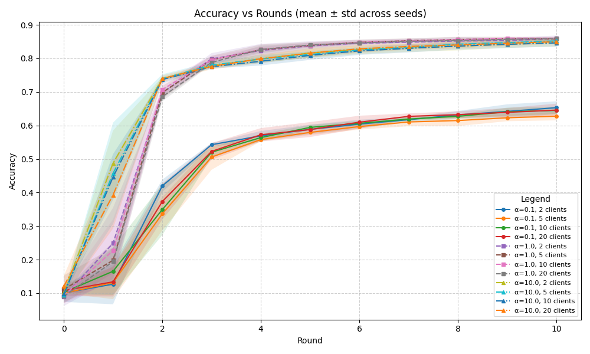

# Federated Learning Experiments with Flower

##  Overview

This project explores the behavior of federated learning systems under different training conditions using the Flower framework.

The goal is to understand how factors such as:

* Number of clients
* Random initialization (seeds)
* Client participation rate

affect model performance, convergence, and robustness.



---

##  Key Insights

* **Robust to Partial Participation**
  Reducing client participation (from 100% to 20%) had minimal impact on accuracy and convergence.

* **Client Count Impacts Stability**
  Increasing the number of clients reduces variance but does not significantly change average performance.

* **Random Seeds Matter**
  Training results vary noticeably across seeds → reproducibility and statistical evaluation are important.

* **Federated Learning is Resilient**
  Aggregation across rounds allows the system to maintain stable performance even with incomplete or noisy updates.

---
##  Why This Project Matters

Federated learning is increasingly important for:

* Privacy-preserving AI
* Distributed IoT systems
* Edge computing

This project demonstrates that:

* Systems can remain stable even with partial participation
* Experimental design (seeds, repetitions) is critical
* Real-world deployment is feasible

---

## ⚙️ Experimental Setup

* Framework: **Flower**
* Training:

  * Multiple client configurations
  * Multiple random seeds
* Evaluation:

  * Accuracy
  * Convergence behavior
  * Variance across runs

---

##  Results

### 1. Effect of Client Participation

* Tested participation rates from **0.2 to 1.0**
* Result: **No significant degradation in performance**


---

### 2. Effect of Number of Clients


* Tested different number fo clients: 3, 5 and 10
* Result: **As seen in point 1, different client participation doesn´t have an impact.** 

---

### 3. Effect of IID and non-IID data 


* Having IID provides a higher number of accuracy
* Havinh Non-IID scenarios represent some specific cases in real life

---

## 🛠️ Tech Stack

* Python
* Flower (Federated Learning Framework)
* NumPy / Pandas
* Matplotlib / Seaborn

---

## 📌 Future Work

* Add heterogeneous client data distributions (non-IID)
* Introduce communication constraints
* Evaluate different aggregation strategies
* Integrate real-world datasets

---

## 👨‍💻 Author

Marco Barrera
MSc Data Science

---

⭐ If you find this project useful, feel free to star the repo!

## Install dependencies and project

The dependencies are listed in the `pyproject.toml` and they can installed as follows:

```bash
pip install -e .
```

> **Note:** Your `pyproject.toml` file can define more than just the dependencies of your Flower app. It specifies hyperparameters for the runs and control which Flower Runtime is used. By default, it uses the Simulation Runtime, but it can switch to the Deployment Runtime when needed.
> More info can be seen here: [TOML configuration guide](https://flower.ai/docs/framework/how-to-configure-pyproject-toml.html).

## Run with the Simulation Engine

In the `app-research-project` directory, use `flwr run` to run a local simulation:

```bash
flwr run .
```
Or feel free to use any of the current python codes to run specific scenarios (different number of clients across multiple seeds, different data distributions, and even different partial) client participation. For this use (example):
```bash
python results_clients_withoutSEEDS.py.
```
**Note:** Its important that you are inside the correct repository to run the python codes!

Once you run any of the files that start with "results......py", the simulated data will be saved inside the "results" folder. This data can be visualized by running the codes inside the python plotting folder. The plots will be later saved in "plots" folder.
